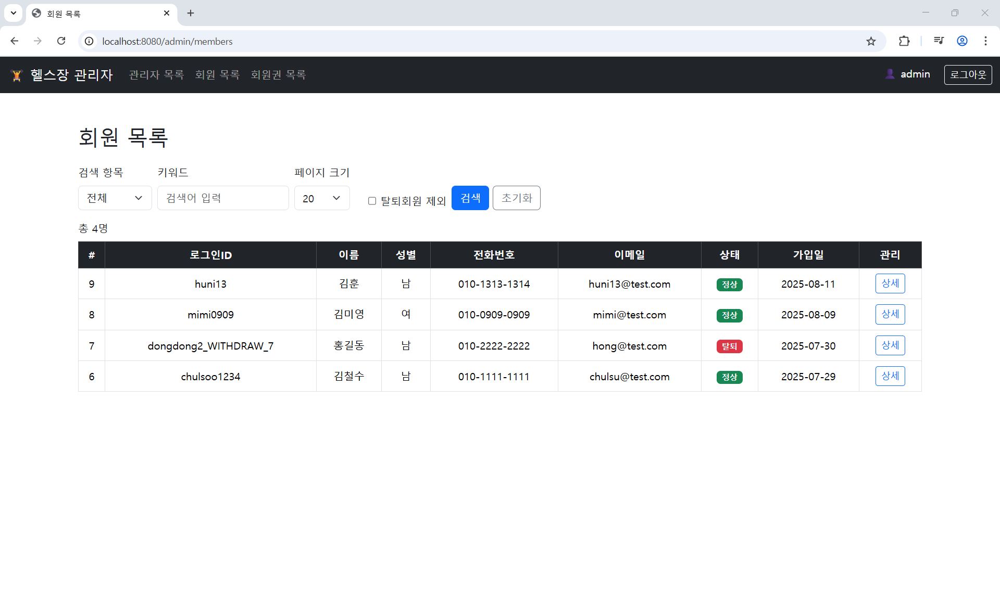

# 🏋️ 헬스장 회원 및 회원권 관리 시스템

## 📌 프로젝트 소개
헬스장 운영을 위한 **회원 관리 및 회원권 관리 시스템**입니다.  
관리자(Admin)와 회원(Member) 권한을 구분하여, 회원 가입, 회원권 등록/수정, 정지, 환불 처리 등의 기능을 제공합니다.

본 프로젝트는 **Spring Boot + MyBatis + Oracle** 기반으로 개발되었으며 포트폴리오용 개인 프로젝트입니다.

---

## ⚙️ 기술 스택
- **Backend** : Java, Spring Boot, MyBatis, Spring Security
- **Database** : Oracle
- **Frontend** : Thymeleaf, Bootstrap
- **Tool / Env** : IntelliJ IDEA, GitHub, Gradle

---

## ✨ 주요 기능
- 로그인/회원가입 (회원 / 관리자 분리)
- 회원 관리 (가입, 수정, 탈퇴)
- 회원권 관리 (등록, 수정, 정지, 환불)
- 환불 요청 및 처리 (승인/반려 + 로그 기록)
- 관리자 권한에 따른 접근 제어 (Spring Security 적용)

---

## 🔑 권한별 기능

### 🎩 관리자 (ROLE_ADMIN)
- **관리자 관리**
    - OWNER: 모든 관리자 수정 가능
    - 일반 관리자: 본인 정보만 수정 가능 (권한 제한)
- **회원 관리**
    - 목록/상세 조회, 탈퇴 처리
- **회원권 관리**
    - 등록, 수정, 상세, 목록 조회
- **회원권 정지 관리**
    - 등록, 수정, 상세, 목록 조회
- **회원권 환불 처리**
    - 환불 요청 목록 / 상세 조회
    - 승인 / 반려 버튼 처리
    - 모든 이력 로그 기록

### 👤 회원 (ROLE_MEMBER)
- **회원 정보 관리**
    - 본인 정보 가입 / 수정 / 탈퇴
- **회원권**
    - 본인 회원권 목록/상세 조회
    - 환불 요청 등록
    - 환불 요청 내역 및 상세 확인 (승인/반려 여부 및 사유 확인)
- **불가 기능**
    - 회원권 정지 요청 ❌
    - 회원권 직접 등록 ❌

---
### 📸 화면 예시

- 로그인 페이지
- 

- 회원 목록 페이지
- 

- 환불 요청 페이지
- 

- 회원권 상세 페이지
- 

- 환불 처리(승인/반려) 페이지
- 

---
### 📂 프로젝트 구조
```
src/
└── main/
    ├── java/com/project/gym
    │   ├── controller   # 컨트롤러 계층
    │   ├── service      # 서비스 계층
    │   ├── mapper       # MyBatis 매퍼
    │   ├── domain       # 엔티티
    │   └── dto          # DTO
    └── resources/
        ├── mapper       # SQL XML
        └── templates    # Thymeleaf

```
---
### 📝 추가 개선 계획

- AWS/OCI 클라우드 배포

- 카카오페이 결제 연동

- 회원 출석 체크 기능